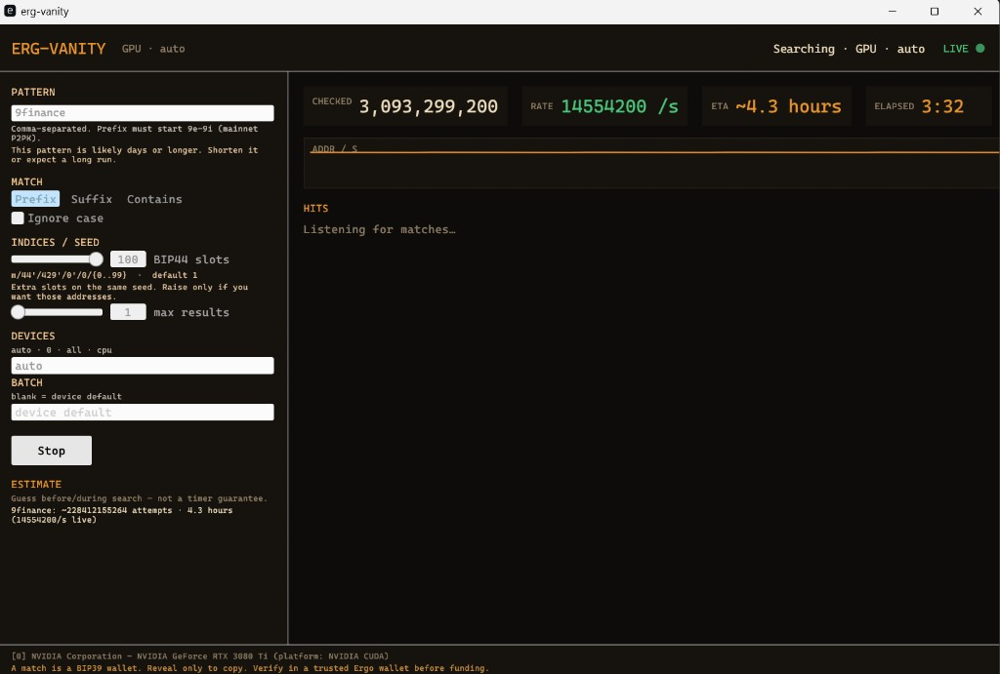

# erg-vanity-gpu

[](https://github.com/arkadianet/erg-vanity-gpu/actions/workflows/ci.yml)

GPU-accelerated Ergo vanity address generator (OpenCL). Prefix search uses the GPU when OpenCL is available; otherwise the CPU path runs. Suffix and contains matching are CPU-only.

This is the surviving repo for arkadianet vanity tools. The older CPU/GUI project [ergo-vanitygen-rust](https://github.com/arkadianet/ergo-vanitygen-rust) is superseded here.

> **Unaudited crypto — use at your own risk.**
>
> BIP39, BIP32, secp256k1, and the rest were written from scratch and are not audited. Do not store significant funds on a generated address until you independently verify the mnemonic in trusted software (for example the official Ergo wallet).
>
> **Mnemonics and entropy are secrets.** Treat match output as a wallet dump. `Debug` redacts them; stdout does not.

## Quick start

Download a [release](https://github.com/arkadianet/erg-vanity-gpu/releases) binary (Windows zip, Linux or macOS tarball), or build:

```bash
cargo build --release -p erg-vanity-cli
```

Run `erg-vanity` / `erg-vanity.exe` with no arguments for the GUI. Use `--no-gui` to stay in the terminal.

- Prefix patterns must start `9e`–`9i` (Ergo mainnet P2PK)
- Prefix uses the GPU when OpenCL is available; **suffix and contains are CPU-only**
- Devices: `auto` / `0` / `all` / `cpu`
- BIP44 slots default **1**. More slots = more addr/s on the same seeds
- Stop to keep hits. Verify the mnemonic in a trusted Ergo wallet before funding



*Live ~14.5M addr/s with BIP44 slots set to 100 on an RTX 3080 Ti. That is not the `--index 1` seed rate (~600k seeds/s on the same card).*

## Features

- GPU prefix search (OpenCL); CPU fallback when no GPU is present
- Suffix / contains matching (`-e` / `--contains`) — CPU only
- Desktop GUI — run `erg-vanity` with no patterns
- `--estimate` before a long search
- Multi-GPU (`--devices 0,1` or `all`)
- Multiple patterns (up to 64; longest prefix wins)
- BIP44 path `m/44'/429'/0'/0/{address_index}` (default `--index 1` derives only `/0`)

## Install

**Prerequisites:** Rust stable (2021 edition) and an OpenCL runtime.

```bash
# Ubuntu/Debian
sudo apt-get install ocl-icd-opencl-dev opencl-headers

# macOS: OpenCL is included
# Windows: install the GPU vendor OpenCL SDK (NVIDIA CUDA, AMD, or Intel)
```

```bash
git clone https://github.com/arkadianet/erg-vanity-gpu.git
cd erg-vanity-gpu
cargo build --release -p erg-vanity-cli
```

Binary: `./target/release/erg-vanity` (Windows: `.\target\release\erg-vanity.exe`).

PowerShell chains commands with `;`, not `&&`.

## Run

```bash
# Prefix search (GPU if available)
./target/release/erg-vanity 9err
./target/release/erg-vanity -p 9err,9ego,9fun
./target/release/erg-vanity -p 9ErGo -i
./target/release/erg-vanity -p 9err -n 5
./target/release/erg-vanity -p 9err --duration-secs 60

# CPU-only suffix
./target/release/erg-vanity -p cafe -e --devices cpu

# Difficulty estimate
./target/release/erg-vanity -p 9ergo --estimate

# Desktop GUI
./target/release/erg-vanity
```

`--index` is a count, not a path index. Default **1** derives only `m/44'/429'/0'/0/0`. `--index N` (1–100) derives address indices `0..N-1` on the same seed. Do not raise the default.

### Devices

```bash
./target/release/erg-vanity --list-devices
./target/release/erg-vanity -p 9err --devices 0,1
./target/release/erg-vanity -p 9err --devices all
./target/release/erg-vanity -p 9err --devices cpu
```

Default `--devices` is `auto` (GPU if present, else CPU).

### CLI

| Option | Default | Description |
|--------|---------|-------------|
| `-p, --pattern <patterns>` | (required for CLI) | Comma-separated patterns |
| `[PATTERN]` | — | Legacy single positional pattern |
| `-e, --suffix` | off | Match at end of address (CPU) |
| `--contains` | off | Match anywhere (CPU) |
| `-i, --ignore-case` | off | Case-insensitive |
| `-n, --max-results <N>` | `1` | Stop after N matches |
| `--index <N>` | `1` | Address indices `0..N-1` per seed (1–100) |
| `--devices <list>` | `auto` | `auto`, `0,1`, `all`, or `cpu` |
| `--batch-size <N>` | device default | Search batch size |
| `--estimate` | off | Print difficulty and exit |
| `--no-gui` | off | Do not open the GUI |
| `--duration-secs <N>` | — | Maximum runtime |
| `--list-devices` | — | List GPUs and exit |
| `--bench` | off | GPU microbenchmark |
| `--bench-iters <N>` | `100` | Timed iterations |
| `--bench-warmup <N>` | `5` | Warmup iterations |
| `--bench-batch-size <N>` | `262144` | Bench batch size |
| `--bench-num-indices <N>` | from `--index` | Bench address indices |
| `--bench-validate` | off | Check bench kernels for degenerate output |

Exit codes: `0` success, `1` runtime error, `2` bad arguments / invalid pattern.

### Pattern rules

Prefix (GPU) patterns must look like a mainnet P2PK start:

- First character `9`
- Second character `e`, `f`, `g`, `h`, or `i` (uppercase allowed with `-i`)
- Base58 only (no `0`, `O`, `I`, `l`)
- Max 32 characters per pattern, 64 patterns, 1024 bytes total

Valid: `9e`, `9err`, `9ergo`, `9fUN`, `9heLLo`

Invalid prefix: `9a` (second char), `9eO` (Base58), `8err` (first char)

Suffix / contains skip the `9e`–`9i` prefix rule.

## Output

```text
=== Match 1 ===
Device:   0
Address:  9errK7Qa3oBVHbS4uGFPSe7ETvfHkZGcskV1gqGf6fqLUPAamo
Pattern:  9err
Path:     m/44'/429'/0'/0/0
Mnemonic: … 24 words …
Entropy:  … 64 hex chars …
```

`Mnemonic` and `Entropy` recover the wallet. Every shown hit is re-checked with `ergo-lib` before print.

Progress goes to stderr: `Checked: N (rate addr/s) [found/target]`.

## Performance

Measured **RTX 3080 Ti**, 19 Aug 2026, default `--index 1`, after comb *k*·G and batched SHA-512 W:

| Mode | Result |
|------|--------|
| Live search | ~600k seeds/s (measured ~590–610k; earlier ~330k → ~368k → ~455k) |
| Isolated PBKDF2 | ~1600 ns/seed (~56–64% of isolated time) |
| Isolated BIP32 | ~628 ns/addr |
| Isolated secp256k1 | ~285 ns/addr |

`--bench` times isolated kernels (OpenCL event timestamps). Isolated PBKDF2 share is **not** ~85% and **not** ~172 µs/seed — those figures are stale.

```bash
./target/release/erg-vanity --bench
./target/release/erg-vanity --bench --bench-validate
```

Expected wait for a **single** prefix on a 3080 Ti at ~600k seeds/s (`5 × 58^(n−2)` combinations, 1.2× `--estimate` factor). Pre-search GUI/CLI times are a hardware guess; live ETA uses the measured addr/s.

| Pattern | Combinations | Expected time |
|---------|--------------|---------------|
| 4 chars (`9err`) | ~17K | < 1 second |
| 5 chars (`9ergo`) | ~976K | ~2 seconds |
| 6 chars (`9ergoo`) | ~57M | ~1.9 minutes |
| 7 chars | ~3.3B | ~1.8 hours |

Rates vary by GPU, driver, and pattern. Raising BIP44 slots multiplies **addr/s**, not seeds/s. RTX 4090 is higher; we have not published a current measurement.

## How it works

1. Entropy from CSPRNG salt + counter (Blake2b on GPU)
2. BIP39: 24-word mnemonic
3. PBKDF2-HMAC-SHA512 (2048 rounds) → seed
4. BIP32/44: `m/44'/429'/0'/0/{address_index}`
5. secp256k1 compressed pubkey
6. Ergo P2PK (Blake2b checksum + Base58)
7. Pattern match

GPU work items run that pipeline in parallel. P2PK mainnet only; path is not configurable. Short patterns can overflow the 1024-hit GPU buffer (a warning is printed).

## Docs

| Document | Contents |
|----------|----------|
| [Security](docs/security.md) | Secrets, Debug redaction, entropy, verification |
| [Development](docs/development.md) | Build, test, CI, GPU kernels, crate map |

## License

MIT. Author: arkadianet.

Contributions welcome: `cargo fmt`, `cargo clippy --workspace --all-targets -- -D warnings`, and tests. See [docs/development.md](docs/development.md).
